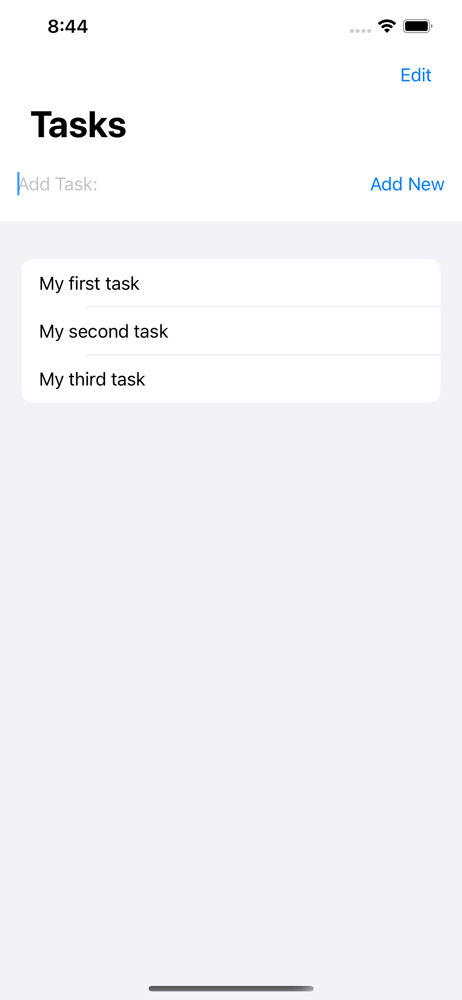
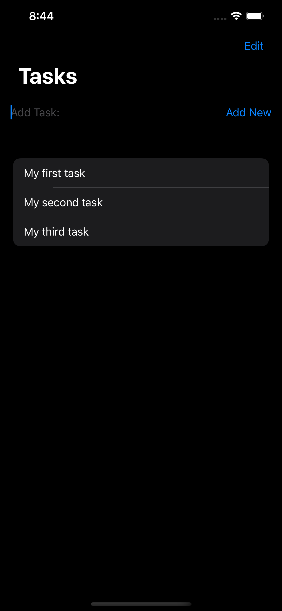

# LibreTasks

LibreTasks is currently under development and currently holds a 
minimally-usable version of the app.

LibreTasks intends to be a simple FOSS tasks app for iOS, written in 
Swift.

## TODO

- [ ] Data persistance - currently, data is cleared upon app exit
- [ ] Notification reminders for upcoming tasks
- [ ] App icons
- [ ] Possibly a settings page for app themes, credits/licensing, etc.

## Collaboration

I am always open to collaboration! I have only started working on this in 
my spare time since development is hobby and not my full-time job, but 
the goal is to get this app to a state where it could replace the default 
iOS reminders app for those who prefer FOSS alternatives.

If you're interested in contributing to this project, feel free to submit 
a pull request or reach out with 
questions ([hello@cleberg.io](mailto:hello@cleberg.io)).

## Screenshots

| Light Mode                                   | Dark Mode                                  |
|----------------------------------------------|--------------------------------------------|
|  |  |
