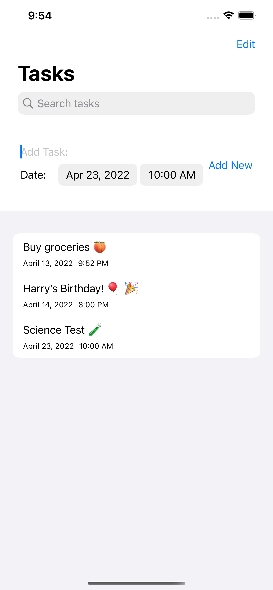

# LibreTasks

**NOTICE:** LibreTasks (ios-tasks) is no longer under development and currently 
holds a minimally-usable version of the app. This is the last update and will 
not be maintained further.

LibreTasks intended to be a simple open-source tasks app for iOS, written 
in Swift.

## TODO

### Priority

- [ ] Data persistance - currently, data is cleared upon app exit
- [ ] Functionality to edit existing tasks
- [x] App icons

### Backlog

- [ ] Notification reminders for upcoming tasks
- [ ] Possibly a settings page for app themes, credits/licensing, etc.

## Collaboration

I am always open to collaboration! I have only started working on this in 
my spare time since development is hobby and not my full-time job, but 
the goal is to get this app to a state where it could replace the default 
iOS reminders app for those who prefer open-source alternatives.

If you're interested in contributing to this project, feel free to submit 
a pull request or reach out with 
questions ([hello@cleberg.net](mailto:hello@cleberg.net)).

## Screenshots

| Light Mode                                   | Dark Mode                                  |
|----------------------------------------------|--------------------------------------------|
|  |  |
